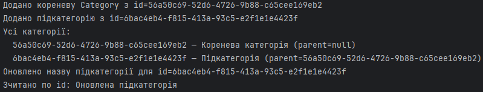
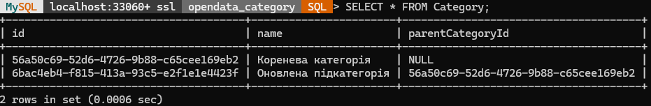

# Документація: База даних `Category`

**Тема:** Система управління відкритими даними

---

## 1. Мета та опис проекту

У цьому модулі реалізовано DAO-шар для роботи з таблицею `Category`, яка служить для ієрархічної категоризації записів відкритих даних. Реалізовано:

- SQL-скрипт створення бази даних та таблиці `Category`.
- Клас-модель `Category` з геттерами/сеттерами.
- DAO-інтерфейс `CategoryDAO` з методами CRUD.
- Реалізацію `CategoryDAOImpl` через JDBC.
- Утилітний клас `CategoryDBConnection` для отримання єдиного з’єднання з MySQL.
- Тестовий клас `CategoryMain` для демонстрації роботи CRUD-операцій.

---

## 2. SQL-скрипт для створення БД і таблиці

```sql
-- Створення бази даних
CREATE DATABASE IF NOT EXISTS category_db;
USE category_db;

-- Створення таблиці Category
CREATE TABLE Category (
    id CHAR(36) PRIMARY KEY,
    name VARCHAR(100) NOT NULL,
    parentCategoryId CHAR(36),
    FOREIGN KEY (parentCategoryId) REFERENCES Category(id) ON DELETE SET NULL
);
```

> **Примітка:** Виконайте цей скрипт у MySQL перед запуском Java-коду.

---

## 3. Опис Java-кодів

### 3.1. `Category.java` (модель)
```java
package com.example.model;

import java.util.UUID;

/**
 * Модель для рядка таблиці Category
 */
public class Category {
    private UUID id;
    private String name;
    private UUID parentCategoryId;

    public Category() {}

    public Category(UUID id, String name, UUID parentCategoryId) {
        this.id = id;
        this.name = name;
        this.parentCategoryId = parentCategoryId;
    }

    public UUID getId() { return id; }
    public void setId(UUID id) { this.id = id; }

    public String getName() { return name; }
    public void setName(String name) { this.name = name; }

    public UUID getParentCategoryId() { return parentCategoryId; }
    public void setParentCategoryId(UUID parentCategoryId) { this.parentCategoryId = parentCategoryId; }
}
```

### 3.2. `CategoryDAO.java` (інтерфейс)
```java
package com.example.dao;

import com.example.model.Category;
import java.util.List;
import java.util.UUID;

/**
 * Інтерфейс CRUD-операцій для Category
 */
public interface CategoryDAO {
    void addCategory(Category category);
    Category getCategoryById(UUID id);
    List<Category> getAllCategories();
    void updateCategory(Category category);
    void deleteCategory(UUID id);
}
```

### 3.3. `CategoryDBConnection.java` (утиліта)
```java
package com.example.util;

import java.sql.Connection;
import java.sql.DriverManager;
import java.sql.SQLException;

/**
 * Клас для встановлення з'єднання з MySQL для opendata_category
 */
public class CategoryDBConnection {
    private static final String URL =
        "jdbc:mysql://localhost:3306/opendata_category?useSSL=false&serverTimezone=UTC";
    private static final String USER = "root";
    private static final String PASS = "pswd";
    private static Connection conn;

    public static Connection getConnection() {
        if (conn == null) {
            try {
                conn = DriverManager.getConnection(URL, USER, PASS);
            } catch (SQLException e) {
                e.printStackTrace();
                throw new RuntimeException("Cannot connect to category_db");
            }
        }
        return conn;
    }
}
```

### 3.4. `CategoryDAOImpl.java` (реалізація DAO)
```java
package com.example.dao.impl;

import com.example.dao.CategoryDAO;
import com.example.model.Category;
import com.example.util.CategoryDBConnection;

import java.sql.*;
import java.util.*;

/**
 * Реалізація CRUD-методів для таблиці Category
 */
public class CategoryDAOImpl implements CategoryDAO {
    private final Connection conn = CategoryDBConnection.getConnection();

    @Override
    public void addCategory(Category category) {
        String sql = "INSERT INTO Category (id, name, parentCategoryId) VALUES (?, ?, ?)";
        try (PreparedStatement p = conn.prepareStatement(sql)) {
            p.setString(1, category.getId().toString());
            p.setString(2, category.getName());
            if (category.getParentCategoryId() != null) {
                p.setString(3, category.getParentCategoryId().toString());
            } else {
                p.setNull(3, Types.CHAR);
            }
            p.executeUpdate();
        } catch (SQLException e) {
            System.err.println("Помилка при INSERT Category: " + sql);
            e.printStackTrace();
        }
    }

    @Override
    public Category getCategoryById(UUID id) {
        String sql = "SELECT * FROM Category WHERE id = ?";
        try (PreparedStatement p = conn.prepareStatement(sql)) {
            p.setString(1, id.toString());
            ResultSet rs = p.executeQuery();
            if (rs.next()) {
                Category cat = new Category(
                    UUID.fromString(rs.getString("id")),
                    rs.getString("name"),
                    rs.getString("parentCategoryId") != null
                        ? UUID.fromString(rs.getString("parentCategoryId"))
                        : null
                );
                return cat;
            }
        } catch (SQLException e) {
            e.printStackTrace();
        }
        return null;
    }

    @Override
    public List<Category> getAllCategories() {
        List<Category> list = new ArrayList<>();
        String sql = "SELECT * FROM Category";
        try (Statement s = conn.createStatement();
             ResultSet rs = s.executeQuery(sql)) {
            while (rs.next()) {
                Category cat = new Category(
                    UUID.fromString(rs.getString("id")),
                    rs.getString("name"),
                    rs.getString("parentCategoryId") != null
                        ? UUID.fromString(rs.getString("parentCategoryId"))
                        : null
                );
                list.add(cat);
            }
        } catch (SQLException e) {
            e.printStackTrace();
        }
        return list;
    }

    @Override
    public void updateCategory(Category category) {
        String sql = "UPDATE Category SET name = ?, parentCategoryId = ? WHERE id = ?";
        try (PreparedStatement p = conn.prepareStatement(sql)) {
            p.setString(1, category.getName());
            if (category.getParentCategoryId() != null) {
                p.setString(2, category.getParentCategoryId().toString());
            } else {
                p.setNull(2, Types.CHAR);
            }
            p.setString(3, category.getId().toString());
            p.executeUpdate();
        } catch (SQLException e) {
            e.printStackTrace();
        }
    }

    @Override
    public void deleteCategory(UUID id) {
        String sql = "DELETE FROM Category WHERE id = ?";
        try (PreparedStatement p = conn.prepareStatement(sql)) {
            p.setString(1, id.toString());
            p.executeUpdate();
        } catch (SQLException e) {
            e.printStackTrace();
        }
    }
}
```

### 3.5. `CategoryMain.java` (демонстрація)
```java
package com.example.dao;

import com.example.model.Category;
import com.example.dao.CategoryDAO;
import com.example.dao.impl.CategoryDAOImpl;

import java.util.List;
import java.util.UUID;

public class CategoryMain {
    public static void main(String[] args) {
        CategoryDAO dao = new CategoryDAOImpl();

        // 1. Додати кореневу категорію
        UUID rootId = UUID.randomUUID();
        Category root = new Category(rootId, "Коренева категорія", null);
        dao.addCategory(root);
        System.out.println("Додано Category id=" + rootId);

        // 2. Додати підкатегорію
        UUID childId = UUID.randomUUID();
        Category child = new Category(childId, "Підкатегорія", rootId);
        dao.addCategory(child);
        System.out.println("Додано Category id=" + childId);

        // 3. Отримати всі категорії
        List<Category> all = dao.getAllCategories();
        all.forEach(c ->
            System.out.println(c.getId() + " — " + c.getName() + " (parent=" + c.getParentCategoryId() + ")")
        );

        // 4. Оновити
        child.setName("Оновлена підкатегорія");
        dao.updateCategory(child);
        System.out.println("Оновлено Category id=" + childId);

    }
}
```

---

## 4. Скріншоти роботи

Створення категорії

Результат створення


---

## 5. Висновок

В результаті реалізації DAO-шару для таблиці `Category` було:

- Забезпечено повний набір CRUD-операцій для роботи з категоріями.
- Організовано зв’язки «батько–дитина» через зовнішній ключ.
- Створено чітку структуру пакетів: `model`, `dao`, `dao.impl`, `util`.

